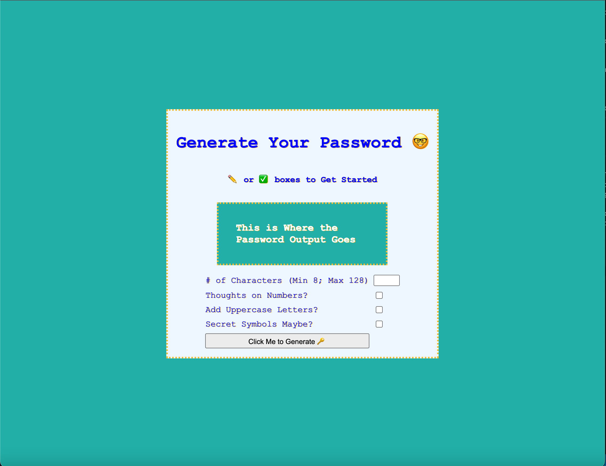

# password-generator

*DISCLAIMER*: With regards to additional resources outside of class, I specifically studied a video by: Web Dev Simplified -- Video titled: "Build A Password Generator With Javascript - Tutorial"
link to resource: https://www.youtube.com/watch?v=iKo9pDKKHnc 

*More on that, I personalized my code with original tags, variable custom styles, etc. But the LAYOUT IS SIMILAR. I wanted to address this up front to avoid potential concerns -- if this is an issue, please let me know and I will re-submit a differently formatted project.*

## About This Project: 

We were asked to create a javascript program that would automatically provide a user with a randomized password that included uppercase, lowercase, symbols, and number values. I believe we were asked to use confirms() and simple HTML/CSS, but I ended up using checkboxes built into a more designful layout instead after further researching how to optimize the functionality of such a program. 

## What I Learned:

1) How to build a HTML website with a data-collecting interface (i.e. the checkboxes and character input values).

2) How to link and build a creative CSS design with simple dynamic functions we have learned over the past week-two. 

3) How to create, assign, and call on new variables in javascript. 

4) How to build for loops that automate the process of seeking out a randomized output. 

5) How to use arrays to provide guided boundaries for for-loops to attract information from. 

6) How to use the .fromCharCodes string to address numbers, symbols, and types by their keycodes instead of manually inputting every possible value/symbol/type. 

## Struggles: 

Getting my button to output the desired function. my form.addEventListener("click", function() {} group continued to cause me issues. I attempted adding .value and .checked to lines 33-36 (see comments), but nothing worked. I think I simply overcomplicated things and got in over my head with external research/resources. I absolutely learned a ton in the process but I strayed away from using the more simplified versions of confirms() and minimalized HTML/CSS. 

## Screenshots: 

 
